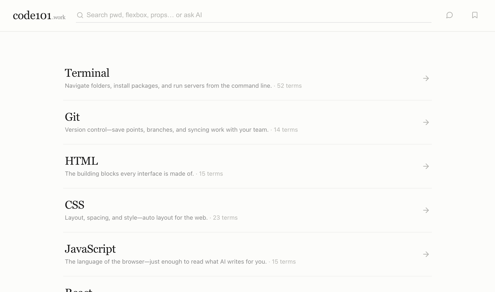
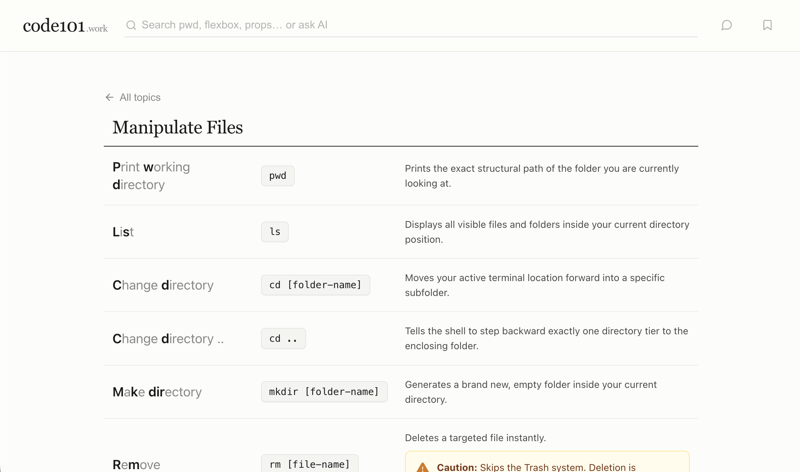
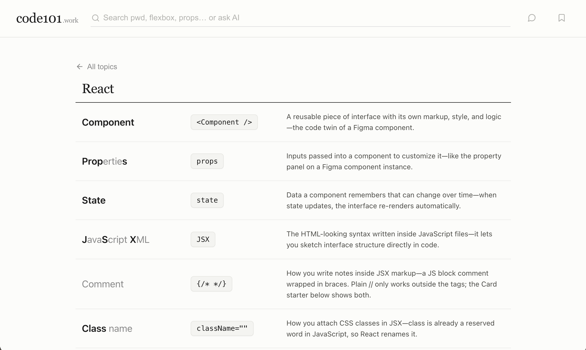
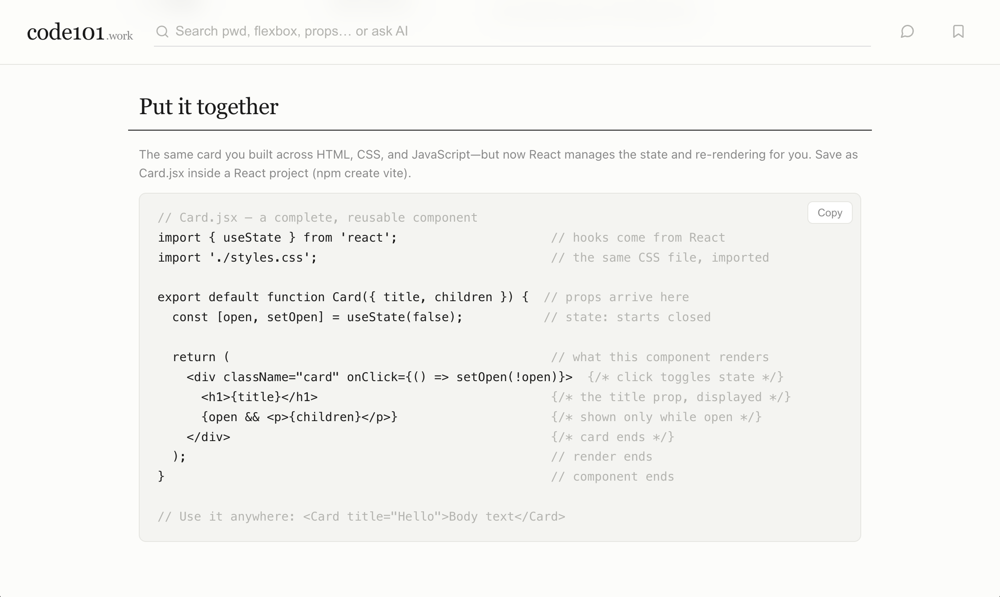
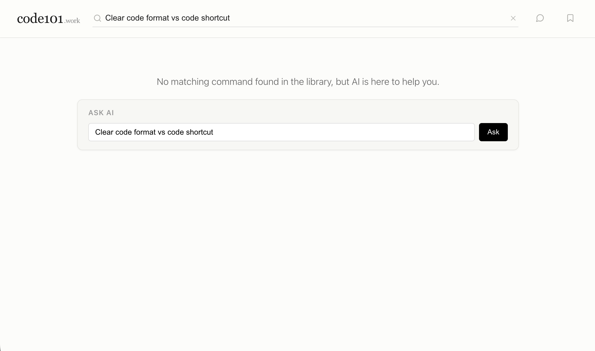

# code101

A visual glossary of essential terminal commands and HTML, CSS, and React concepts — explained in plain English for designers. Live at **[code101.work](https://code101.work)**.

Learn `pwd`, `ls`, `cd`, `git`, flexbox, props, and more, with an "Ask AI" helper for quick command questions.

## Screenshots

**Home — browse by topic**



**A topic — plain-English definitions with the real command**



**React concepts mapped to design ideas**



**"Put it together" — copyable starter code**



**Ask AI — when a term isn't in the library**



## Stack

- **Cloudflare Workers** (`src/index.ts`) — serves static assets and a small API.
- **Static assets** (`public/`) — the entire app is a single inlined `index.html`. No build step, no framework.
- **Workers AI** (`@cf/meta/llama-3.1-8b-instruct`) — powers the "Ask AI" answers.
- **Workers KV** (`FEEDBACK` namespace) — stores anonymous feedback.

## Project layout

```
public/
  index.html      # the whole app — content, styles, and logic inlined
  404.html        # styled not-found page (served for unknown paths)
  sitemap.xml     # lists the homepage
  robots.txt      # allows all crawlers, points to the sitemap
src/
  index.ts        # Worker: API routes + asset fall-through
scripts/
  update-jsonld.js # regenerates JSON-LD structured data from the page data
wrangler.jsonc    # Worker + assets + bindings config
```

## API

| Route | Method | Purpose |
|-------|--------|---------|
| `/api/ask` | POST | `{ question }` → AI answer about a terminal command |
| `/api/feedback` | POST | `{ message?, rating? }` → stored anonymously in KV |
| `/api/health` | GET | health check (`{ status: "ok" }`) |

Any other path falls through to static assets; unknown paths return the custom `404.html`.

## Develop

```bash
npx wrangler dev          # local dev server
```

## Deploy

```bash
npx wrangler deploy       # deploys to code101.work
```

## Editing content

The glossary lives in `commandLibrary` / `topics` inside `public/index.html`.
After adding, removing, or editing entries, regenerate the structured data so
search engines (and AI crawlers) stay in sync:

```bash
node scripts/update-jsonld.js
```
